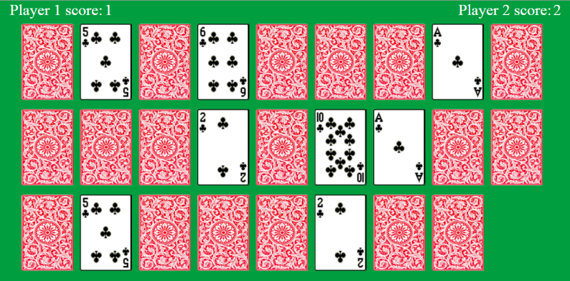

Memory game
========

This is a simple memory game where the computer randomly places 26 playing cards on the screen with there backs facing
the user. The user then clicks on two cards and they will flip over, displaying what number they are. If those two cards
dont match then they are flipped back after a timed delay, giving the user enough time to memorize the two cards. If the
two cards match then they remain front facing. The game tests the users ability to memorize where cards are, so they can
match them up. It can be played two player, where each player takes it in turn to click on two cards.

* First time using CSS animations. They were used in the animation of the deal at the start and for flipping the card
when it is clicked.
* Cards are randomly produced at the start of each game, so their positions on the screen is always different.

[Click here to play (click on the card for the cards to be dealt)](https://rawgit.com/bend101/MemoryGame/master/memoryGame.html)

